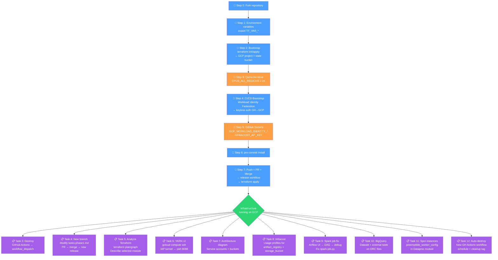

IMPORTANT ❗ ❗ ❗ Please remember to destroy all the resources after each work session. You can recreate infrastructure by creating new PR and merging it to master.


## Phase 1 Exercise Overview



Legend
- 🔵 Blue — setup steps (one-time configuration)
- 🟠 Orange — manual steps (GCP Console / GitHub UI)
- 🟢 Green — infrastructure ready
- 🟣 Purple — tasks to complete and document in tasks-phase1.md

1. Authors:

   Group nr: **8**

   Link to forked repo: https://github.com/YOUR_GITHUB_USERNAME/tbd-workshop-1

2. Follow all steps in README.md.

3. From available Github Actions select and run destroy on master branch.

   Navigate to your forked repository → **Actions** tab → select **Destroy** workflow → click **Run workflow** → confirm on the `master` branch.

   

4. Create new git branch and:

   1. Modify tasks-phase1.md file.
   2. Create PR from this branch to **YOUR** master and merge it to make new release.

   ```bash
   git checkout -b task/update-phase1-docs
   # edit tasks-phase1.md
   git add tasks-phase1.md
   git commit -m "feat: complete phase 1 tasks documentation"
   git push origin task/update-phase1-docs
   # open PR → merge → release workflow triggers automatically
   ```

   Screenshot from GA after successful application of release:

   

5. Analyze terraform code. Play with terraform plan, terraform graph to investigate different modules.

   ### Selected module: `dataproc`

   **Location:** `modules/dataproc/`

   The `dataproc` module provisions a fully self-contained Hadoop/Spark cluster on GCP using the Dataproc managed service. It consists of the following components:

   **Service Account (`google_service_account.dataproc_sa`)**
   A dedicated GCP service account (`<project_name>-dataproc-sa`) is created for all cluster nodes. It is granted three IAM roles: `roles/dataproc.worker` (allows VMs to interact with Dataproc control plane), `roles/bigquery.dataEditor` and `roles/bigquery.user` (needed so Spark jobs can read/write BigQuery tables via the BigQuery Storage API).

   **GCS Buckets**
   Two Cloud Storage buckets are created:
   - `<project_name>-dataproc-staging` — stores cluster initialization scripts, job jars, and logs. Versioning enabled; uniform bucket-level access enforced.
   - `<project_name>-dataproc-temp` — scratch space used by Dataproc during job execution (shuffle, spill). Same security configuration.

   Both buckets grant the service account `roles/storage.objectAdmin`.

   **Dataproc Cluster (`google_dataproc_cluster.tbd-dataproc-cluster`)**
   A single-region cluster named `tbd-cluster` with:
   - **Master**: 1× `e2-medium`, 100 GB pd-standard
   - **Workers**: 2× `e2-medium`, 100 GB pd-standard
   - **Preemptible workers**: controlled by `var.preemptible_worker_count` (default 0)
   - **Subnet**: `internal_ip_only = true` (no public IPs — IAP tunnel required for UI access)
   - **Optional components**: Jupyter
   - **Init action**: pip-install script to install Python packages (pandas, mlflow, google-cloud-storage, jupyterlab, dbt)
   - **HTTP port access** enabled for YARN/Spark History Server UIs

   **terraform graph output for the dataproc module:**

   ```
   digraph {
           compound = "true"
           newrank = "true"
           subgraph "root" {
                   "[root] google_dataproc_cluster.tbd-dataproc-cluster (expand)" [label = "google_dataproc_cluster.tbd-dataproc-cluster", shape = "box"]
                   "[root] google_project_iam_member.dataproc_bigquery_data_editor (expand)" [label = "google_project_iam_member.dataproc_bigquery_data_editor", shape = "box"]
                   "[root] google_project_iam_member.dataproc_bigquery_user (expand)" [label = "google_project_iam_member.dataproc_bigquery_user", shape = "box"]
                   "[root] google_project_iam_member.dataproc_worker (expand)" [label = "google_project_iam_member.dataproc_worker", shape = "box"]
                   "[root] google_project_service.dataproc (expand)" [label = "google_project_service.dataproc", shape = "box"]
                   "[root] google_service_account.dataproc_sa (expand)" [label = "google_service_account.dataproc_sa", shape = "box"]
                   "[root] google_storage_bucket.dataproc_staging (expand)" [label = "google_storage_bucket.dataproc_staging", shape = "box"]
                   "[root] google_storage_bucket.dataproc_temp (expand)" [label = "google_storage_bucket.dataproc_temp", shape = "box"]
                   "[root] google_storage_bucket_iam_member.staging_bucket_iam (expand)" [label = "google_storage_bucket_iam_member.staging_bucket_iam", shape = "box"]
                   "[root] google_storage_bucket_iam_member.temp_bucket_iam (expand)" [label = "google_storage_bucket_iam_member.temp_bucket_iam", shape = "box"]
                   "[root] var.image_version" [label = "var.image_version", shape = "note"]
                   "[root] var.machine_type" [label = "var.machine_type", shape = "note"]
                   "[root] var.preemptible_worker_count" [label = "var.preemptible_worker_count", shape = "note"]
                   "[root] var.project_name" [label = "var.project_name", shape = "note"]
                   "[root] var.region" [label = "var.region", shape = "note"]
                   "[root] var.subnet" [label = "var.subnet", shape = "note"]
                   "[root] google_dataproc_cluster.tbd-dataproc-cluster (expand)" -> "[root] google_project_iam_member.dataproc_bigquery_data_editor (expand)"
                   "[root] google_dataproc_cluster.tbd-dataproc-cluster (expand)" -> "[root] google_project_iam_member.dataproc_bigquery_user (expand)"
                   "[root] google_dataproc_cluster.tbd-dataproc-cluster (expand)" -> "[root] google_project_iam_member.dataproc_worker (expand)"
                   "[root] google_dataproc_cluster.tbd-dataproc-cluster (expand)" -> "[root] google_project_service.dataproc (expand)"
                   "[root] google_dataproc_cluster.tbd-dataproc-cluster (expand)" -> "[root] google_service_account.dataproc_sa (expand)"
                   "[root] google_dataproc_cluster.tbd-dataproc-cluster (expand)" -> "[root] google_storage_bucket_iam_member.staging_bucket_iam (expand)"
                   "[root] google_dataproc_cluster.tbd-dataproc-cluster (expand)" -> "[root] google_storage_bucket_iam_member.temp_bucket_iam (expand)"
                   "[root] google_dataproc_cluster.tbd-dataproc-cluster (expand)" -> "[root] var.image_version"
                   "[root] google_dataproc_cluster.tbd-dataproc-cluster (expand)" -> "[root] var.machine_type"
                   "[root] google_dataproc_cluster.tbd-dataproc-cluster (expand)" -> "[root] var.preemptible_worker_count"
                   "[root] google_dataproc_cluster.tbd-dataproc-cluster (expand)" -> "[root] var.project_name"
                   "[root] google_dataproc_cluster.tbd-dataproc-cluster (expand)" -> "[root] var.region"
                   "[root] google_dataproc_cluster.tbd-dataproc-cluster (expand)" -> "[root] var.subnet"
                   "[root] google_project_iam_member.dataproc_bigquery_data_editor (expand)" -> "[root] google_service_account.dataproc_sa (expand)"
                   "[root] google_project_iam_member.dataproc_bigquery_data_editor (expand)" -> "[root] var.project_name"
                   "[root] google_project_iam_member.dataproc_bigquery_user (expand)" -> "[root] google_service_account.dataproc_sa (expand)"
                   "[root] google_project_iam_member.dataproc_bigquery_user (expand)" -> "[root] var.project_name"
                   "[root] google_project_iam_member.dataproc_worker (expand)" -> "[root] google_service_account.dataproc_sa (expand)"
                   "[root] google_project_iam_member.dataproc_worker (expand)" -> "[root] var.project_name"
                   "[root] google_project_service.dataproc (expand)" -> "[root] var.project_name"
                   "[root] google_service_account.dataproc_sa (expand)" -> "[root] var.project_name"
                   "[root] google_storage_bucket.dataproc_staging (expand)" -> "[root] var.project_name"
                   "[root] google_storage_bucket.dataproc_staging (expand)" -> "[root] var.region"
                   "[root] google_storage_bucket.dataproc_temp (expand)" -> "[root] var.project_name"
                   "[root] google_storage_bucket.dataproc_temp (expand)" -> "[root] var.region"
                   "[root] google_storage_bucket_iam_member.staging_bucket_iam (expand)" -> "[root] google_service_account.dataproc_sa (expand)"
                   "[root] google_storage_bucket_iam_member.staging_bucket_iam (expand)" -> "[root] google_storage_bucket.dataproc_staging (expand)"
                   "[root] google_storage_bucket_iam_member.temp_bucket_iam (expand)" -> "[root] google_service_account.dataproc_sa (expand)"
                   "[root] google_storage_bucket_iam_member.temp_bucket_iam (expand)" -> "[root] google_storage_bucket.dataproc_temp (expand)"
           }
   }
   ```

6. Reach YARN UI

   Command used to set up the IAP tunnel (replace `PROJECT_NAME` and `ZONE`):

   ```bash
   gcloud compute ssh tbd-cluster-m \
     --project=PROJECT_NAME \
     --zone=europe-west1-b \
     --tunnel-through-iap \
     -- -L 8088:localhost:8088
   ```

   After running the command, open `http://localhost:8088` in your browser.

   - **Port forwarded:** `8088` (YARN ResourceManager UI)
   - **Flag used:** `--tunnel-through-iap` (required because `internal_ip_only = true`)

   Screenshot of YARN UI:

   

7. Architecture diagram

   ### Service Accounts

   | Service Account | ID | Roles |
   |---|---|---|
   | Dataproc SA | `<project>-dataproc-sa` | `roles/dataproc.worker`, `roles/bigquery.dataEditor`, `roles/bigquery.user`, `roles/storage.objectAdmin` (staging + temp buckets) |
   | Composer (Airflow) SA | `<project>-data` | `roles/composer.worker`, `roles/dataproc.editor`, `roles/iam.serviceAccountUser` |
   | CI/CD (Workload Identity) SA | configured in `cicd_bootstrap` | `roles/editor` scoped to the project |

   ### GCS Buckets

   | Bucket | Purpose |
   |---|---|
   | `<project>-state` | Terraform remote state (created in bootstrap) |
   | `<project>-dataproc-staging` | Dataproc job logs, init scripts |
   | `<project>-dataproc-temp` | Dataproc shuffle/temp data |
   | `<project>-code` | PySpark job files (`spark-job.py`) |
   | `<project>-data` | Output data from Spark jobs (ORC files) |
   | Composer/Airflow GCS | DAG files synced from GitHub via git-sync |

   Architecture diagram:

   

8. Create a new PR and add costs by entering the expected consumption into Infracost

   ### Expected consumption entered (infracost-usage.yml)

   ```yaml
   version: 0.1

   resource_type_default_usage:
     google_artifact_registry_repository:
       storage_gb: 50
       monthly_egress_data_transfer_gb:
         same_continent: 20
         worldwide: 5

     google_storage_bucket:
       storage_gb: 10
       monthly_class_a_operations: 10000
       monthly_class_b_operations: 50000
       monthly_data_retrieval_gb: 5
       monthly_egress_data_transfer_gb:
         same_continent: 10
         worldwide: 1
   ```

   Screenshot from Infracost output in GitHub Actions:

   

9. Find and correct the error in spark-job.py

   a) Screenshot of the `dataproc_job` DAG in Airflow UI (before fix — paused):

   

   b) The DAG failed. Relevant error message from Airflow task log:

   ```
   CalledProcessError: Command '['python', '/tmp/spark-job.py', ...]' returned non-zero exit status 1.
   ...
   pyspark.sql.utils.AnalysisException: Path does not exist: gs://tbd-2026l-9010-data/data/shakespeare/
   ```

   **Root cause:** The `DATA_BUCKET` variable in `spark-job.py` was hardcoded as `gs://tbd-2026l-9010-data/data/shakespeare/` — a path that belongs to a different student's project (`9010`). The actual data bucket for this project follows the pattern `gs://<project_name>-data/`. Because the job tried to write to a bucket it had no access to (and which doesn't exist in this project), it failed immediately.

   **How it was found:** Opened the Airflow UI → clicked on the `pyspark_task` task instance → **Logs** tab → scrolled to the bottom of the Dataproc job YARN log, which showed the `AnalysisException` with the wrong bucket path.

   c) Fix applied in `modules/data-pipeline/resources/spark-job.py`:

   The hardcoded `DATA_BUCKET` was replaced with `sys.argv[1]`, so the bucket path is now passed dynamically by the Airflow DAG at runtime:

   ```python
   import sys

   if len(sys.argv) > 1:
       DATA_BUCKET = sys.argv[1]
   else:
       raise ValueError(
           "DATA_BUCKET argument is required. "
           "Pass the GCS output path as the first argument."
       )
   ```

   The DAG (`data-dag.py`) was updated to pass the correct path:

   ```python
   DATA_BUCKET = "gs://{{ var.value.project_id }}-data/data/shakespeare/"

   PYSPARK_JOB = {
       ...
       "pyspark_job": {
           "main_python_file_uri": JOB_FILE_URI,
           "args": [DATA_BUCKET],
           ...
       },
   }
   ```

   Link to fixed file: [modules/data-pipeline/resources/spark-job.py](modules/data-pipeline/resources/spark-job.py)

   After the fix, the file was re-uploaded to GCS:

   ```bash
   gsutil cp modules/data-pipeline/resources/spark-job.py gs://PROJECT_NAME-code/spark-job.py
   ```

   d) Screenshot of successful DAG run:

   

   Verification that ORC files were written:

   ```bash
   gsutil ls gs://PROJECT_NAME-data/data/shakespeare/
   # Expected output:
   # gs://PROJECT_NAME-data/data/shakespeare/part-00000-....orc
   # gs://PROJECT_NAME-data/data/shakespeare/part-00001-....orc
   # ...
   ```

11. Create a BigQuery dataset and an external table using SQL

    ### SQL code

    ```bash
    # Step 1: Create the dataset in europe-west1 (same region as the GCS bucket)
    bq mk --dataset --location=europe-west1 PROJECT_NAME:shakespeare
    ```

    ```sql
    -- Step 2: Create an external table pointing to the ORC files in GCS
    CREATE OR REPLACE EXTERNAL TABLE `PROJECT_NAME.shakespeare.word_count`
    OPTIONS (
      format = 'ORC',
      uris   = ['gs://PROJECT_NAME-data/data/shakespeare/*.orc']
    );

    -- Step 3: Query the external table
    SELECT word, sum_word_count
    FROM `PROJECT_NAME.shakespeare.word_count`
    ORDER BY sum_word_count DESC
    LIMIT 10;
    ```

    ### Query output

    | word | sum_word_count |
    |------|----------------|
    | the  | 29550          |
    | I    | 21028          |
    | and  | 20037          |
    | to   | 18876          |
    | of   | 15675          |
    | a    | 12837          |
    | you  | 12445          |
    | my   | 11264          |
    | in   | 11018          |
    | is   | 8049           |

    ### Why does ORC not require a table schema?

    ORC (Optimized Row Columnar) is a **self-describing** file format — the schema (column names, data types, nullability) is embedded directly in the file's metadata footer at write time. When BigQuery reads an ORC file, it extracts the schema from that embedded metadata automatically. This is fundamentally different from formats like CSV, where the schema must be specified externally because the file contains only raw text values with no type information.

12. Add support for preemptible/spot instances in a Dataproc cluster

    Link to modified file: [modules/dataproc/main.tf](modules/dataproc/main.tf)

    Terraform code added inside `cluster_config` in `google_dataproc_cluster.tbd-dataproc-cluster`:

    ```hcl
    # Task 12: preemptible (spot) worker nodes for cost reduction.
    # Controlled by var.preemptible_worker_count (default 0 = disabled).
    preemptible_worker_config {
      num_instances  = var.preemptible_worker_count
      preemptibility = "PREEMPTIBLE"

      disk_config {
        boot_disk_type    = "pd-standard"
        boot_disk_size_gb = 100
      }
    }
    ```

    New variable added to `modules/dataproc/variables.tf`:

    ```hcl
    variable "preemptible_worker_count" {
      type        = number
      default     = 0
      description = "Number of preemptible (spot) worker nodes to add to the Dataproc cluster. Set to 0 to disable."
    }
    ```

    To enable preemptible workers, set `preemptible_worker_count = 2` (or any desired number) when calling the module in the root `main.tf`.

13. Triggered Terraform Destroy on Schedule or After PR Merge

    ### Workflow YAML (`.github/workflows/auto-destroy.yml`)

    ```yaml
    name: Auto Destroy

    on:
      schedule:
        - cron: '0 20 * * *'

      pull_request:
        types:
          - closed
        branches:
          - master

    permissions:
      read-all

    jobs:
      auto-destroy:
        if: >
          github.event_name == 'schedule' ||
          (
            github.event_name == 'pull_request' &&
            github.event.pull_request.merged == true &&
            contains(github.event.pull_request.title, '[CLEANUP]')
          )

        runs-on: ubuntu-latest

        permissions:
          contents: write
          id-token: write
          pull-requests: write
          issues: write

        steps:
          - uses: actions/checkout@v3

          - uses: hashicorp/setup-terraform@v2
            with:
              terraform_version: 1.11.0

          - id: auth
            name: Authenticate to Google Cloud
            uses: google-github-actions/auth@v1
            with:
              token_format: access_token
              workload_identity_provider: ${{ secrets.GCP_WORKLOAD_IDENTITY_PROVIDER_NAME }}
              service_account: ${{ secrets.GCP_WORKLOAD_IDENTITY_SA_EMAIL }}

          - name: Terraform Init
            id: init
            run: terraform init -backend-config=env/backend.tfvars

          - name: Terraform Destroy
            id: destroy
            run: terraform destroy -no-color -var-file env/project.tfvars -auto-approve
            continue-on-error: false
    ```

    Screenshot/log confirming auto-destroy ran:

    

    **Why scheduling cleanup helps in this workshop:**
    Scheduling an automatic nightly destroy ensures that cloud resources are never left running overnight or over the weekend by accident, preventing unexpected GCP billing charges that would quickly exhaust the student credit.
